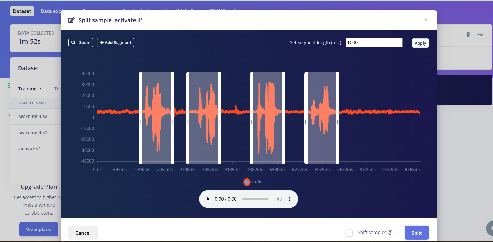
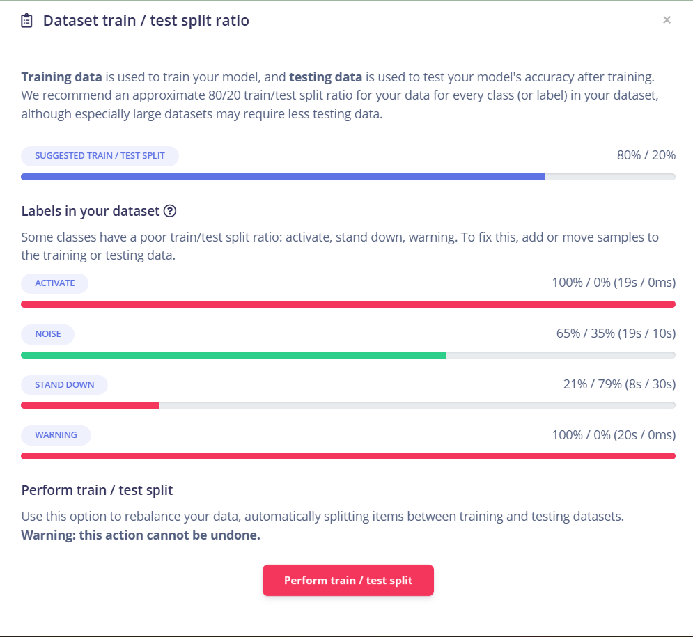
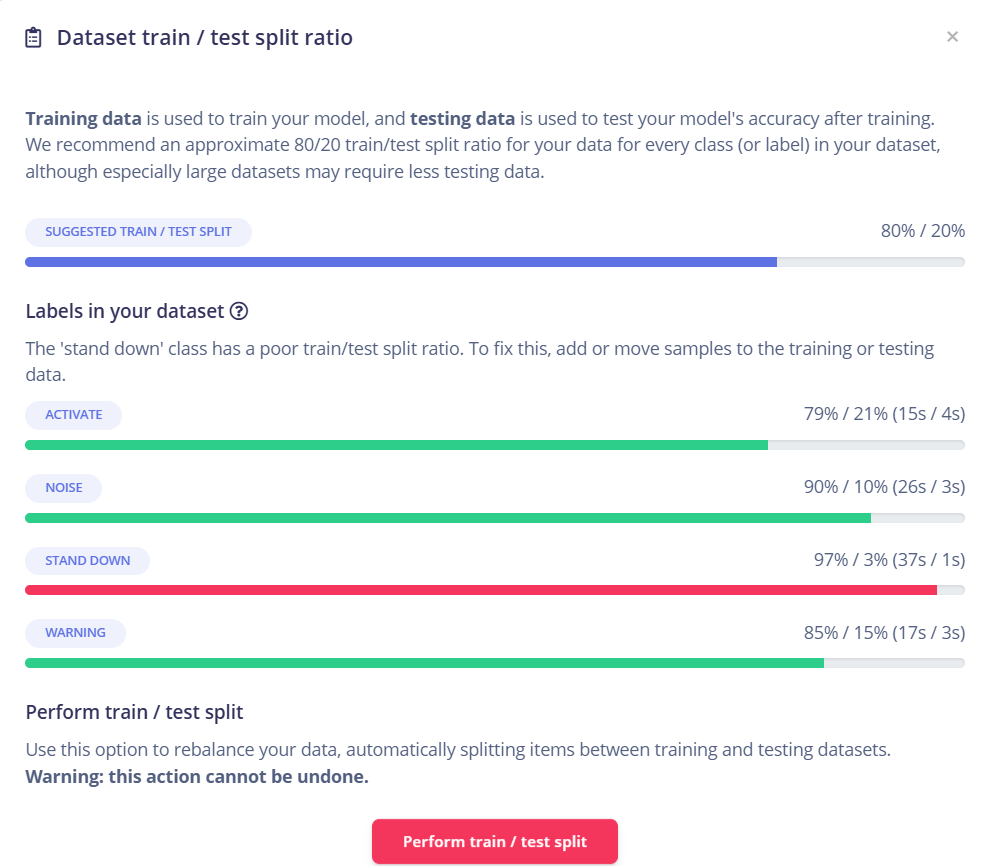

# Tiny ML Audio Classification

AI is all about data so that machine can learn. 

We have to use "Edge Impulse"

Refer slides for better understanding 

First, we are collecting the audio data.

Then we have to upload the data on EdgeImpulse and we can split as seen in image

After spliting the data, we will get a non uniform dataset which is not goot to use

so here, if we do test train split, then we will get fairly uniform data

Then we do feature extraction and labelling and cleaning of data is done, in short, making it ready to use.

