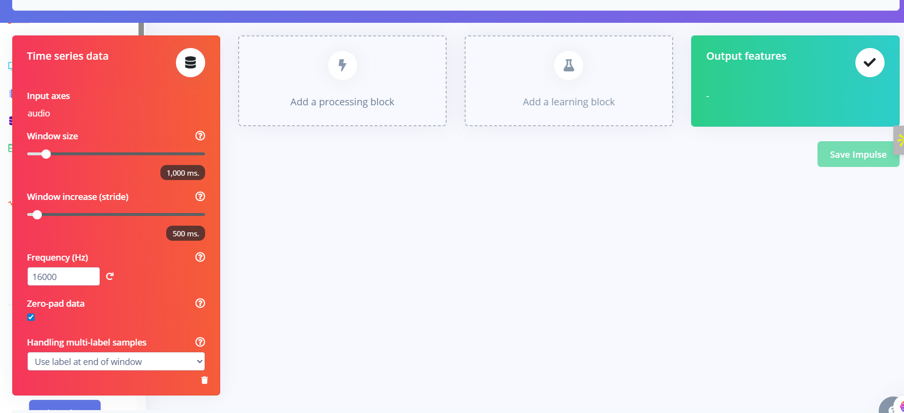

# Audio Classification

Zero padding - If sample is shorter than uniform decided period os sample then the remaining part is covered by silence, that is called Zero Padding.

MFCC - used to recognize human voice 

Please refer the slides for detailed understanding

## Creating an Impluse

Now we will continue by creating an impulse.

You will get this window - 

Each one sec sample will be converted into image (13*49*1)

We will add MFCC by clicking on "add processing block"

Now we will select Keras framework for CNN classification 

Under "add a learnig block", we will select Classification, below you can see all the available learning blocks. 

then we will save the impulse and below is the window picture after doing all this. 

CNN architecture - extracted data is passed through CNN layers to extract features automatically 

Layers -> Flatten(Single dimension for decision making)-> Fully Connected -> FC -> Softmax

Input layer -> Reshaping -> CNN layer -> Dropout -> CNN layer -> Dropout -> Flattening -> Output layers

Data Augmentation - generating multiple variants of the same data point by changing color, angle of a picture

## MFCC

Now we jump on MFCC option on left menu column

After that a new windoe will open there, we have to click on "autotune parameters" as we dont know about setting of parameters and then we have to save the parameters.

After auto tuning we will get this window and we have to click on Click on "Generate features"

These is the result - we have got the features 

## Classfier

Now, we will jump to the classifier section 

we see these layers 

Layers -> Flatten(Single dimension for decision making)-> Fully Connected -> FC -> Softmax

Input layer -> Reshaping -> CNN layer -> Dropout -> CNN layer -> Dropout -> Flattening -> Output layers

This is the window that we will get, and now you have to click on Train.

Now, we will train and evaluate, and we will get the confusion matrix

After this we can retrain it too but it is optional 

then we will go to Live classification but for that we have to connect a devide so we will skip

Next is model testing, we can click on classify all. 

Find the results below and note that I have got accuracy of 90.9 % having one mismatch

after we can do caliberation and deployemnt on hardware

for deployment, we can select "Arduino" library and go ahead with the process.

We will receive a ZIP file after building i have included that file in code section

We have to add this file to Arduino 

Use the source code provided in the slides to deploy in ESP using Arduino IDE

We can optimise parameters like mas_confidence if discrepancy in results

